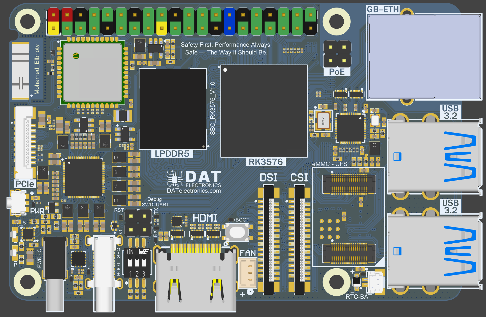
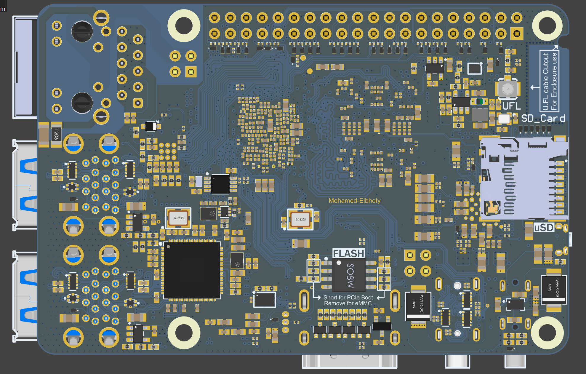
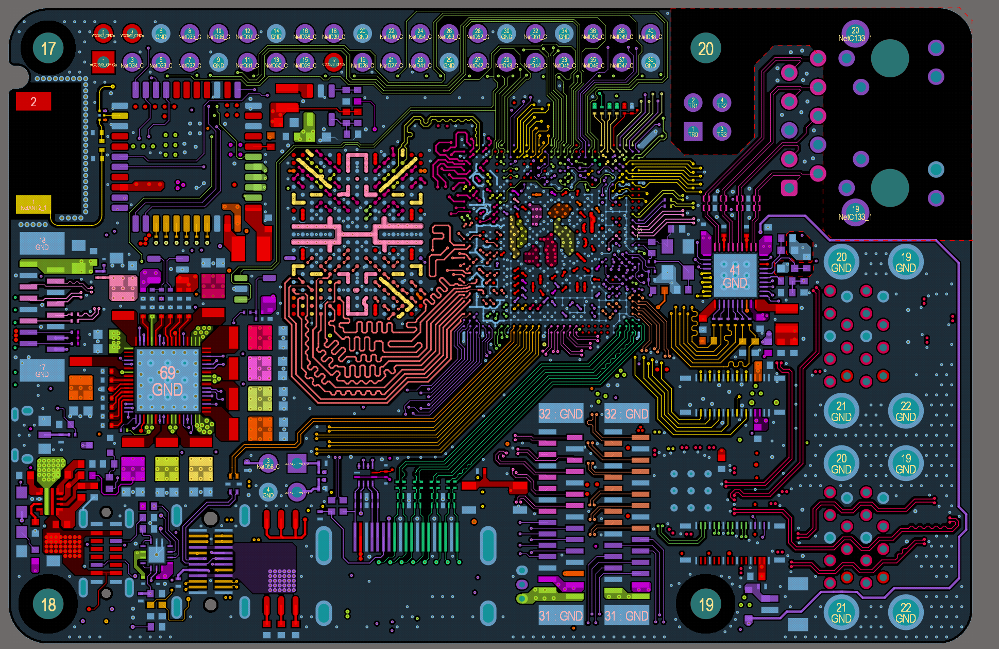

# RK3576-SBC
I'm proud to share my latest High speed PCB,
and the Second Board of my custom SBCs.
This time with pics form the SCH and Layout:

*SBC_RK3576_V1.0
A fully custom-designed Single Board Computer based on the Rockchip RK3576, 
built from scratch – schematics, layout.

The board is designed for industrial use, 
AI applications, and advanced embedded applications.

Big thanks to PCBWay for sponsoring this project!

Key Features:
10 Layers PCB only TH Via.
Stack-Up:
1-Signal / 2-GND / 3-PWR / 4-PWR / 5-GND / 6-Signal / 7-GND / 8-Signal / 9-GND / 10-Signal.
Multiple impedance profiles: S40 OHM / S50 OHM / D85 OHM / D90 OHM / D95 OHM / D100 OHM

SoC:
CPU: RK3576 ,Dual-cluster 8-cores 2.2 GHz (4x Cortex-A72 + 4x A53).
GPU: GPU-Mali-G52 MC3 (OpenGL ES 3.2 / Vulkan 1.1 / OpenCL 2.0).
NPU: 6 TOPS NPU (INT4 / INT8 / INT16 / FP16 / TF32 / BF16).
RAM: 32-bit LPDDR5 up to 16GB.

Storage:
eMMC: Modular eMMC5.1 up to 128GB and Support SPI Flash.
UFS: UFS 2.0-HS-G3 (12 Gbps) up to 1TB storage capacity.
SDMMC: Support microSD.

Display:
Display1: HDMI 2.1 up to 8K@60fps or 4K@120fps with CEC.
Display2: USB Type‑C Alt Mode with Power Delivery (PD) negotiation,
 *Supports USB3.2 and DisplayPort v1.4 2.5K@60fps via the same PHY.
Display3: 2K@60fps MIPI DSI 4-Lane.

Network Connectivity:
1- Gigabit Ethernet with PoE (PoE optional).
2- Wi-Fi 6 or Wi-Fi 5 + BT5.4 with internal Dual band antenna,
 *External antenna via uFL connector.
 *RF path selectable via onboard RF switch.

USB Connectivity:
1- 4x USB 3.2 Host.
2- 1x USB Type‑C Alt Mode (PD) OTG/HOST.

Camera:
MIPI CSI: 4-lane or split to 2-lane + 2-lane.

RTC:
Internal RTC with JST connector for external battery.

Storage or Expansion Interfaces:
1- PCIe 2.1 1-Lane through FPC connector.
2- SATA Gen 3 through FPC connector.
3- 40-pin GPIO Header With load Swithes and ESD Diodes, Supports:
 *28x GPIOs / 13x PWM.
 *1x CAN-BUS.
 *5x UART (with flow control) / 5x I2C / 1x I3C / 2x SPI.
 *1x PDM / 1x SDI.
 *1x SAR-ADC 12-bit resolution, up to 1MS/s sampling rate.
 *3.3V output only / 5V ouput or input with UVLO-OVLO.

Power-up Using:
1- USB Type‑C power only connector 5V 3A or 5A - UVLO-OVLO Protected.
2- USB Type‑C Alt Mode (PD), you can use it as power input also.
3- PoE option or from 40-pin GPIO Header.

Other Peripherals:
1- Active Cooling Fan connector.
2- Boot sequence DIP Switch.
3- Mask-room Tactile Switch.
4- Power ON/OFF Tactile Switch.
5- Dual LEDs for Power and activity.
6- 4 Pins Header for Debug UART or SWD.

Secure Element:
Hardware-based security chip for device authentication and secure key storage,
providing cryptographic services over I²C.
Used for secure boot, device identity, and protection against cloning.

OS Support: Linux / Android-14 / Yocto / Buildroot

Thanks to everyone who supported this journey.

If you're interested in collaboration or want to give feedback, feel free to leave a comment or DM me!

